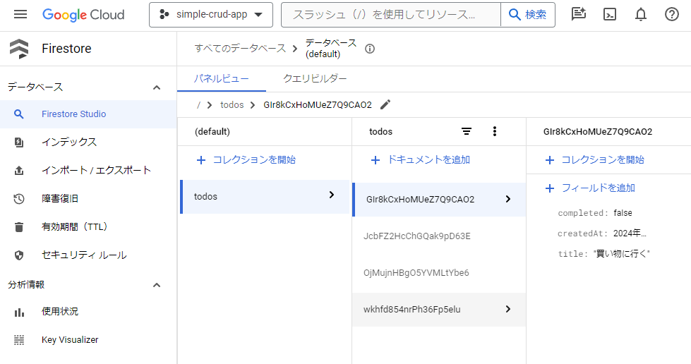
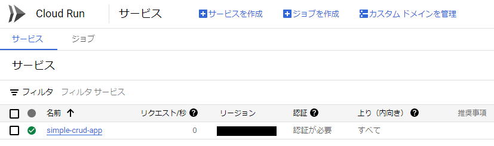
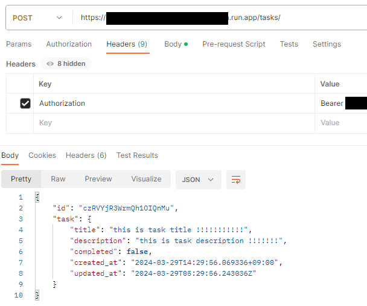
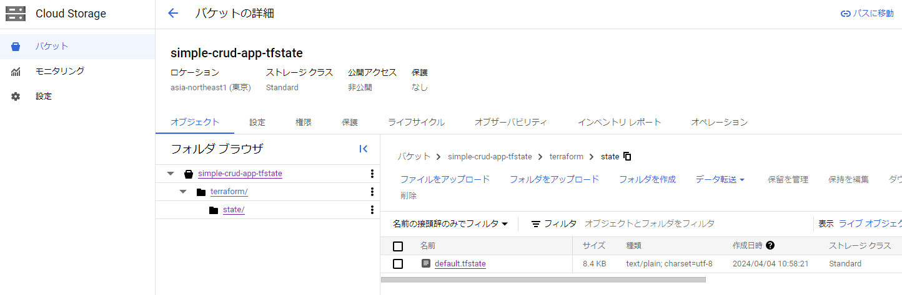

# 開発メモ

## TerraformでFirestoreインスタンスを作る
- GCPリソースの操作にはサービスアカウントのキーが必要
- キーの情報をTerraformに渡せる状態にしておく必要がある
- サービスアカウントのキー作成時にダウンロードできるjsonファイルをローカルに保存
- `terraform.tfvars`で以下のように記述しておくとTerraform環境変数に読み込まれる

```
GOOGLE_APPLICATION_CREDENTIALS = "path/to/gcp-service-account-key.json"
project_id                     = "****************"
region                         = "****************"
```

- 環境変数は`main.tf`などにて`var.{環境変数名}`でアクセスできる

```tf
provider "google" {
  credentials = file("${var.GOOGLE_APPLICATION_CREDENTIALS}")
  project     = var.project_id
  region      = var.region
}
```

- サービスアカウントはTerraformやその他プログラムがリソース操作に使うためのアカウント
- このサービスアカウントはリソース操作に必要な権限を持っている必要がある
  - 権限はロールで表現され、`Cloud Datastoreオーナー`等がある
  - 権限が不足していると`terraform apply`時にエラーが発生する
- サービスアカウントやロールの設定はGCPコンソールのIAMから行う

## Firebase SDKでFirestoreデータベースにデータを挿入する
- Firestoreデータベース名を **`(default)`** にする必要がある点に注意 :warning:
  - Firebase SDKはGCPプロジェクトに紐付くデフォルトのFirestoreデータベースを対象とする
  - つまり、デフォルト名である`(default)`と名付けられたFirestoreデータベースを参照する
  - TerraformのHCLでFirestoreリソースを定義する際、`name`属性を必須で要求されるが、ここを`(default)`にしておかないといけない
  - Firebase SDKでFirestoreデータベース名を明示的に指定することはできない
  - Firebase SDKはサービスアカウントのキーからGCPプロジェクトIDを特定し、アカウントに付与された権限を使って`(default)`データベースにアクセスする
- [insert_firestore.py](./src/insert_firestore.py)のコードで認証し、Firestoreデータベースにデータを挿入できた



## オニオンアーキテクチャにする
- ディレクトリ構成を以下のように変更

```py
app/ # FastAPIプロジェクトのルートディレクトリ
├── application/ # application層: ユースケースやビジネスロジックを定義する
│   ├── __init__.py
│   └── task_service.py
├── domain/ # domain層: ドメインオブジェクトやエンティティを定義する
│   ├── __init__.py
│   └── task.py
├── infrastructure/ # infrastructure層: データベースやキャッシュへのアクセスを定義する
│   ├── __init__.py
│   └── task_repository.py
├── interface/ # interface層(presentation層): ユーザーインターフェイスやAPIを定義する
│   ├── __init__.py
│   ├── controller.py # ユースケースやリポジトリの生成知識を隠蔽する
│   ├── models.py # webAPIのリクエスト/レスポンスモデルを定義する
│   └── routes.py # FastAPIのルーティングを定義する
└── main.py # FastAPIプログラムのエントリポイント
```

### オニオンアーキテクチャのシーケンス図
```plantuml
participant interface
participant application
participant domain
participant infrastructure

-> interface: webAPIリクエスト
interface -> application: ユースケースの呼び出し
application -> domain: 必要に応じてドメインオブジェクトを操作
application -> infrastructure: データベースへのアクセス
infrastructure -> application: データベースからの結果
application -> interface: ユースケースの結果を返す
<- interface : レスポンスの生成&送信
```

## ドメインモデルとwebAPIの入出力モデルについて
- 例えばToDo管理アプリではDBにToDoとなるタスクを登録するユースケースがある
- このタスクをドメインモデルとして定義すると以下のようになる

```py
class Task(BaseModel):
  """
  タスクモデル。

  属性:
  title: str - タスクのタイトル。
  description: str - タスクの説明。
  completed: bool - タスクの完了状態。デフォルトはFalse。
  created_at: datetime - タスクの作成時刻。デフォルトは現在時刻。
  updated_at: datetime - タスクの最終更新時刻。デフォルトは現在時刻。
  """

  title: str
  description: str
  completed: bool = False
  created_at: datetime = Field(default_factory=datetime.now)
  updated_at: datetime = Field(default_factory=datetime.now)
```

- 一方でタスクを登録するPOSTリクエストのbodyに必要なモデルは以下のようになる

```py
class TaskCreateIn(BaseModel):
  """
  タスクの入力モデルを表します。

  属性:
      title (str): タスクのタイトルです。
      description (str): タスクの説明です。
  """

  title: str
  description: str
```

- `Task`にあったいくつかの属性は`TaskCreateIn`では不要となる
- このように、ドメインモデルとwebAPIの入出力モデルは必ずしも一致しない
- webAPIの設計によっては`requied`なデータと`optional`なデータに分かれるため、そこでもドメインモデルと一致しない場合が出てくる
- 無理に共通化するべきではなく、ドメインモデルとwebAPIの入出力モデルは別々に定義するべき
  - このトレードオフとして、ドメインモデル変更時にwebAPIの入出力モデルも変更する必要がある

## pythonのモジュール検索パスについて

```py
app/
├── domain/
│   └── task.py
├── interface/
│   └── routes.py
```

- 上記のような位置関係にある場合、routes.pyがtask.pyの`Task`をimportするには以下のように記述する

### app/interface/routes.py
```py
from ..domain import Task
```

- これはlinuxの相対ファイルパスと同じで`app/interface/`から見て1つ上の階層(app/)にあるdomainモジュールをimportするという意味になる
- あまりファイル間の位置関係を意識したimportは書きたくないので、ルートディレクトリからの相対パスでimportを統一したい
- pythonにはモジュール検索pathが設定されており`sys.path`でアクセスできる

### app/main.py
```py
import sys
from pathlib import Path

# app/をpythonモジュール検索パスに追加し、app/からの相対パスでimportできるようにする
sys.path.append(str(Path(__file__).parent))
```

- プログラム開始時にプロジェクトのルートディレクトリをモジュール検索pathに追加することで、以下のようにルートからの相対パスによるimportが可能となる

### app/interface/routes.py
```py
from domain import Task
```

## FastAPIサーバプログラムをDockerコンテナイメージ化してGCPにpushする
- devcontainerとは別にデプロイ用の[Dockerfile](./Dockerfile)を用意
- その上で以下のコマンドを実行してDockerコンテナイメージをGCPにpushする

```sh
gcloud builds submit --tag gcr.io/{project-id}/{tag-name}
```

## CloudRunへのデプロイをTerraformで自動化する
- `main.tf`に以下のCloudRunリソース定義を追加する
- template/spec/containers/imageでGCRのコンテナイメージを指定する

### main.tf

```tf
resource "google_cloud_run_service" "default" {
  name     = "simple-crud-app"
  location = var.region

  template {
    spec {
      containers {
        image = "gcr.io/${var.project_id}/simple-crud-app"
      }
    }
  }

  traffic {
    percent         = 100
    latest_revision = true
  }
}
```

- 上のtfファイルを使って`terraform plan && terraform apply`
- CloudRun上にサービスとしてデプロイされていることがわかる



## CloudRunにデプロイしたFastAPIサーバにリクエストを送信する
- デフォルトではCloudRunへのアクセスには認証が必要となる

### Authorization headerでの認証
- postmanやcurlでリクエストする場合、headerに以下の設定が必要となる
- `Authorization`キーに対する値として`Bearer `に続けて`gcloud auth print-identity-token`で取得したトークン文字列を設定する
- print-identity-tokenは現在gcloud CLIでアクティブになっている(=認証されている)アカウントのOIDCトークンを出力する
- どのアカウントがアクティブになっているかは`gcloud auth list`で確認できる
- アカウントの認証は`gcloud auth login`で行う
- このOIDCトークンは一定時間で期限切れとなる

### CloudRunサービスURLの扱い
- CloudRunのサービスURLの書式は`https://{SERVICE_IDENTIFIER}.run.app`になっている
- これに続けて`/{endpoint}`を記述することでwebAPIへのリクエストURLになる
- Dockerfileでポート番号を指定しているが、CloudRunは内部でリバースプロキシを利用して転送してくれているため、サービスURLに続けてポート番号を指定する必要は無い

### FastAPIルーティングで設定したエンドポイントの扱い
- 現在FastAPIのルーティングはroutes.pyに分離したものをmain.pyでimportしている
- `@router.post()`に`"/"`を与えているため、ToDoタスクを新規作成するためのエンドポイントにリクエストを送る場合は`tasks`ではく`tasks/`にする必要がある点に注意
  - `@router.post("")`とすることで`tasks`でリクエストできるようになる
  - `tasks/`でリクエストした場合は`tasks`にリダイレクトしてくれる
- postmanやcurlでリクエストする際のURLは`https://{SERVICE_IDENTIFIER}.run.app/tasks/`となる

#### routs.py
```py
router = APIRouter()
@router.post("/")
async def create_task(task: TaskCreateIn):
```

#### main.py
```py
app = FastAPI()
app.include_router(tasks_router, prefix="/tasks")
```



## Terraformのstate管理について
- Terraformはインフラの状態を`terraform.tfstate`ファイルで管理している
- 通常tfstateファイルはローカルに生成されるが、チーム開発ではリモートバックエンド(AWS S3やGoogleCloudStorage)でtfstateファイルを管理することが推奨されている
- リモートバックエンドでtfstateを管理することで以下の恩恵を受けられる
  - stateファイルのバージョニング
  - stateの排他制御
- 以下のようにtfファイルで`backend`ブロックを用意することでリモートバックエンドを設定できる

### main.tf
```
terraform {
  required_providers {
    google = {
      source  = "hashicorp/google"
      version = "~> 5.21"
    }
  }

  # terraformのstateファイルをGCSに保存する
  backend "gcs" {
    # バケットは予め作っておく
    bucket = "simple-crud-app-tfstate"
    prefix = "terraform/state"
    # backendブロックではvariableは使えないのでベタ書きする
    credentials = ".devcontainer/gcp-service-account-key.json"
  }
}
```



## GitHub Actionsでビルド&デプロイする
### docker imageのbuild + Google Container Registryへのpush
- GitHub secretsに以下を登録しておく必要がある
  - `GCP_SA_KEY`: GCPのサービスアカウント鍵ファイルのjsonデータ
  - `GCP_PROJECT_ID`: GCPのプロジェクトID
- `docker/build-push-action@v5`で作るdocker imageのtagについて
  - git commitのSHAをtag名とするのが一般的なのでそれに倣う
  - また、最後に作ったimageには`latest`タグも付けておく
  - `latest`タグを付けると、以前に同じタグを付けたimageからは`latest`タグが外れる
- copilotで提示されたアクション(`actions/checkout@v4`)のバージョンには注意
  - 古い場合があるので必ずアクション毎にgithubリポジトリを確認して最新バージョンを使うこと

```yml
runs-on: ubuntu-latest
    steps:
    - name: Checkout code
      uses: actions/checkout@v4

    - name: Set up Docker Buildx
      uses: docker/setup-buildx-action@v3

    - name: Login to Google Container Registry
      uses: docker/login-action@v3
      with:
        registry: gcr.io
        username: _json_key
        password: ${{ secrets.GCP_SA_KEY }}

    - name: Build and push Docker image
      uses: docker/build-push-action@v5
      with:
        context: .
        push: true
        tags: |
          gcr.io/${{ secrets.GCP_PROJECT_ID }}/simple-crud-app:${{ github.sha }}
          gcr.io/${{ secrets.GCP_PROJECT_ID }}/simple-crud-app:latest
```

### TerraformでGCPにデプロイする
- CI/CD環境にはローカルで使っていた以下が存在しないので別途再現する必要がある
  - `terraform.tfvars`ファイル: main.tfのvariablesで参照する
  - `gcp-service-account-key.json`ファイル: main.tfのbackendやproviderブロックで参照する
- いずれもGitHub secretsに登録しておき、そこからローカル限定のファイルとして再構築する

```yml
  terraform:
    needs: build-and-push-container-image
    runs-on: ubuntu-latest

    steps:
    - name: Checkout code
      uses: actions/checkout@v4

    - name: Setup Terraform
      uses: hashicorp/setup-terraform@v3

    - name : Setup Google Cloud credentials
      env:
        GCP_SA_KEY: ${{ secrets.GCP_SA_KEY }}
      run: |
        echo "$GCP_SA_KEY" > ./gcp-service-account-key.json

    - name: Create terraform.tfvars
      run: |
        cat << EOF > terraform.tfvars
        project_id = "${{ secrets.GCP_PROJECT_ID }}"
        region = "${{ secrets.GCP_REGION }}"
        EOF

    - name: Terraform Init
      run: terraform init

    - name: Terraform Plan
      run: terraform plan

    - name: Terraform Apply
      run: terraform apply -auto-approve
```